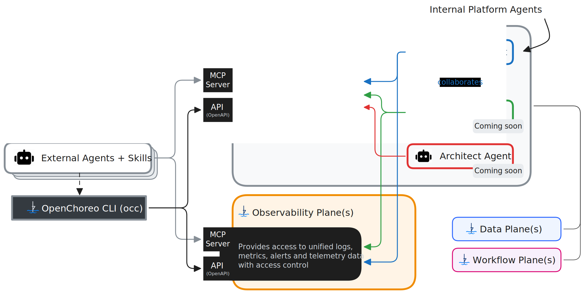

# Working with AI

AI is reshaping how platform engineering teams build, operate, and troubleshoot software. OpenChoreo is built to meet that shift — with first-class AI integration that lets your developers and operators work alongside AI assistants naturally. Whether you're using Claude Code, Cursor, Gemini CLI, or another AI assistant, OpenChoreo gives it the context it needs to act.

## MCP Servers

OpenChoreo exposes [Model Context Protocol (MCP)](https://modelcontextprotocol.io/) servers for both the **Control Plane** and the **Observability Plane**. This means your AI assistant can:

- **Discover and manage resources** — list namespaces, projects, components, environments, and deployment pipelines directly from a chat prompt
- **Trigger and monitor builds** — kick off workflow runs and check their status without leaving your editor
- **Query observability data** — fetch logs, metrics, traces, alerts, and incidents by asking questions in natural language
- **Deploy and promote** — update release bindings and promote components across environments through conversational workflows

This turns your AI assistant into an active participant in your platform operations — not just a code suggester, but a collaborator that understands your infrastructure.

See the [MCP Servers Reference](../reference/mcp-servers.mdx) for the full list of available tools and server configuration options, and follow [Configuring MCP Servers with AI Assistants](./mcp-servers.mdx) to connect your AI assistant to OpenChoreo.

## Built-in Agents

Beyond MCP, OpenChoreo ships with AI agents that run autonomously inside the platform.

### FinOps Agent

Cloud costs grow quietly until they become a problem. The **[FinOps Agent](./finops-agent.mdx)** analyzes Kubernetes resource usage of your OpenChoreo components and generates cost optimization reports with rightsizing recommendations. Instead of manually correlating utilization data, teams get clear, LLM-generated guidance on where spend can be reduced.

### SRE Agent

When something goes wrong in production, finding the root cause is expensive. The **[SRE Agent](./sre-agent.mdx)** automates that investigation by analyzing logs, metrics, and traces from your OpenChoreo deployments and generating a report with likely root causes. Instead of engineers spending hours correlating signals across dashboards, the SRE Agent delivers actionable insights the moment an alert fires.

### Perch Agent

Platform context is scattered across CRDs, dashboards, and log stores — answering "what is this component doing?" often means jumping between five tools. The **[Perch Agent](./perch-agent.mdx)** is a read-only chat assistant embedded in Backstage that talks to the OpenChoreo and Observability MCP servers (and the SRE Agent when deployed) so your team can ask questions in natural language — list projects, inspect a component, query runtime logs, or pull an existing RCA report — without leaving the developer portal. Perch is read-only by contract: it can list, get, and query, but never create, update, or delete.
