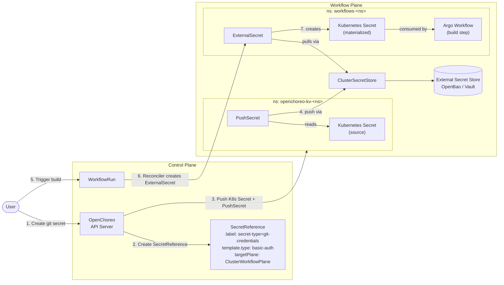

# Using Private Git Repositories

OpenChoreo supports building components from private Git repositories using **basic authentication** or **SSH authentication**. Credentials are securely managed through external secret stores and are never stored in OpenChoreo's control plane.

## Prerequisites

Before configuring private repository access, ensure you have:

- **External Secret Store**: A configured secret store (e.g., Vault, AWS Secrets Manager, OpenBao)
- **ClusterSecretStore**: A ClusterSecretStore resource in the workflow plane that connects to your secret store
- **Git Credentials**: One of the following:
  - **For Basic Auth**: Personal access token (PAT) or username/password with repository read access
  - **For SSH Auth**: SSH private key registered with your Git provider

## Authentication Methods

| Method         | Use Case                                                 |
| -------------- | -------------------------------------------------------- |
| **Basic Auth** | HTTPS Git URLs (e.g., `https://github.com/org/repo.git`) |
| **SSH Auth**   | SSH Git URLs (e.g., `git@github.com:org/repo.git`)       |

## From UI

The easiest way to configure private repository access is through the OpenChoreo UI. You can create secrets either during component creation or pre-create them for reuse.

:::note
The UI flows below require the secret management feature to be enabled in the control-plane Helm chart. It is disabled by default. Set `features.secretManagement.enabled=true` in the `openchoreo-control-plane` Helm values to turn it on. The k3d single-cluster install and the quick-start install enable it out of the box.
:::

### During Component Creation

1. When creating a component that uses a private repository, select **Create New Git Secret** from the secret reference dropdown:


2. Enter your Git credentials (username/token or SSH key) and click **Create**.


3. The newly created secret will be automatically selected. Use it for component creation.

### Secret Management Page

You can also pre-create secrets in the Secret Management page for reuse across multiple components.

1. Navigate to the Secret Management page, click **Create Secret**, and select **Git Credentials** as the category:


2. When creating a component, select the secret from the dropdown in the secret reference field.

## From YAML

For manual configuration, create a `SecretReference` custom resource that points to credentials in your external secret store.

```yaml
apiVersion: openchoreo.dev/v1alpha1
kind: SecretReference
metadata:
  name: github-credentials
  namespace: default
spec:
  targetPlane:
    kind: ClusterWorkflowPlane
    name: default
  template:
    type: kubernetes.io/basic-auth
  data:
    - secretKey: username
      remoteRef:
        key: secret/git/github-token
        property: username
    - secretKey: password
      remoteRef:
        key: secret/git/github-token
        property: token
  refreshInterval: 1h
```

Reference the secret in your component's workflow configuration:

```yaml
apiVersion: openchoreo.dev/v1alpha1
kind: Component
metadata:
  name: my-service
spec:
  owner:
    projectName: my-project
  componentType:
    kind: ClusterComponentType
    name: deployment/service
  workflow:
    kind: ClusterWorkflow
    name: dockerfile-builder
    parameters:
      repository:
        url: https://github.com/myorg/private-repo.git
        secretRef: github-credentials
        revision:
          branch: main
        appPath: /
      docker:
        context: .
        filePath: ./Dockerfile
```

## How It Works



When a workflow run is triggered:

1. **Control Plane**: The OpenChoreo API server stores a `SecretReference` and pushes the source `Kubernetes Secret` together with a `PushSecret` to the target plane's `openchoreo-kv-<ns>` namespace.
2. **Workflow Plane (push path)**: `PushSecret` reads the source Kubernetes Secret and pushes its contents to the external secret store through the `ClusterSecretStore`.
3. **Workflow Plane (pull path)**: When the `WorkflowRun` is reconciled, the controller creates an `ExternalSecret` in the `workflows-<ns>` namespace. The `ExternalSecret` pulls the secret from the external store via the same `ClusterSecretStore` and materializes a Kubernetes Secret for the build.
4. **Workflow Execution**: Argo Workflow uses the materialized secret for Git authentication.
5. **Cleanup**: The `ExternalSecret` and its materialized Kubernetes Secret are automatically removed when the `WorkflowRun` is deleted. The push-side resources in `openchoreo-kv-<ns>` are owned by the `SecretReference` and removed when it is deleted.

## Additional Resources

- [Creating Workflows](../../../platform-engineer-guide/workflows/creating-workflows.mdx) — Creating custom workflows with secret support
