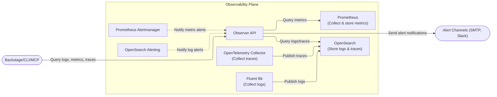
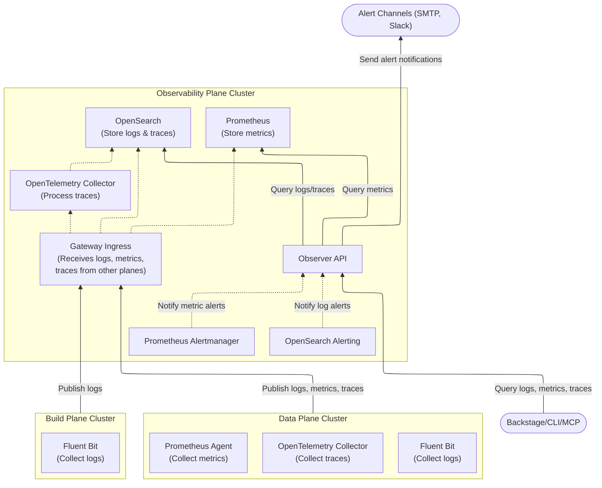

import CodeBlock from '@theme/CodeBlock';
import {versions} from '../_constants.mdx';

# Observability & Alerting

OpenChoreo provides an optional observability plane, which consists of a comprehensive observability stack for monitoring applications deployed on the platform.

This guide covers how to configure and use logging, metrics, traces, and alerting capabilities.

## Overview

OpenChoreo's default observability architecture consists of:

| Pillar | Components |
|--------|-----------|
| **Logs** | Fluent Bit as the log collector and OpenSearch as the log storage |
| **Metrics** | Prometheus to collect and store metrics|
| **Traces** | OpenTelemetry Collector as the trace collector and processor, and OpenSearch as the trace storage |
| **Alerting** | Prometheus Alertmanager for metric alerts, and OpenSearch Alerting for log alerts |

All observability data is accessible through the **Observer API**, which provides a unified interface for querying logs, metrics, and traces.

## Architecture

### Single-Cluster Setup

In single-cluster mode, all planes run in the same Kubernetes cluster.
Observability data is collected directly from the data planes and build plane
via the agents deployed in the observability plane.



### Multi-Cluster Setup

In multi-cluster mode, the observability plane runs on a dedicated cluster.
Data planes and build plane deploy local collectors that publish observability data
to the observability plane through gateway ingress.



In this setup:
- **Data Plane** deploys Fluent Bit to collect logs, Prometheus Agent to collect metrics, and OpenTelemetry Collector to collect traces
- **Build Plane** deploys Fluent Bit to collect build logs
- All collectors publish data to the **Gateway** in the Observability Plane
- The **Observer API** queries OpenSearch and Prometheus to serve unified observability data

For detailed multi-cluster setup instructions, see [Multi-Cluster Connectivity](./multi-cluster-connectivity.mdx).

## Prerequisites

- OpenChoreo control plane installed
- Data plane and build plane (optional) installed to observe
- Observability plane installed (see [Installation](#installing-the-observability-plane))

### Resource Requirements

| Component | CPU Request | CPU Limit | Memory Request | Memory Limit |
|-----------|-------------|-----------|----------------|--------------|
| OpenSearch (per node) | 100m | 1000m | 1Gi | 1Gi |
| Observer | 100m | 200m | 128Mi | 200Mi |
| Prometheus | 100m | 200m | 128Mi | 256Mi |
| Fluent Bit | 100m | 200m | 128Mi | 256Mi |
| OpenTelemetry Collector | 50m | 100m | 100Mi | 200Mi |

## Installing the Observability Plane

Refer to [Getting Started](../getting-started/try-it-out/on-k3d-locally.mdx#step-8-setup-observability-plane-optional)
or [Multi-Cluster Connectivity](./multi-cluster-connectivity.mdx#observability-plane)
for instructions on installing the observability plane in single-cluster or multi-cluster mode.

---

## Observability

### Logs

OpenChoreo collects container logs using **Fluent Bit** and stores them in **OpenSearch**.
By default, logs are collected from all containers in the cluster, except for the Fluent Bit containers.
Collected logs are enriched with Kubernetes metadata to support querying by OpenChoreo labels.

#### Log Collection Configuration

The Fluent Bit configuration can be customized via Helm values:

```yaml
fluent-bit:
  enabled: true
  config:
    inputs: |
      [INPUT]
          Name tail
          Path /var/log/containers/*.log
          Tag kube.*
          # ... additional configuration
    filters: |
      [FILTER]
          Name kubernetes
          Match kube.*
          Merge_Log On
    outputs: |
      [OUTPUT]
          Name opensearch
          Host opensearch
          Port 9200
          Match kube.*
```

#### Logs Retention Configuration

Collected logs are retained for a default of 30 days and can be configured as required.

#### Querying Logs

The Observer API provides a REST API for querying logs of a specific OpenChoreo component.
This can be accessed via the Backstage portal, OpenChoreo CLI or OpenChoreo MCP server.
Observer handles the authentication and authorization based on OpenChoreo user identity.

---

### Metrics

OpenChoreo collects metrics using **Prometheus** and **kube-state-metrics**. The metrics stack provides:

- Container resource metrics (CPU, memory)
- HTTP request metrics (when instrumented via Hubble with Cilium CNI)

#### Available Metrics

| Metric Type | Description | Source |
|-------------|-------------|--------|
| CPU Usage | Container CPU utilization | cAdvisor |
| Memory Usage | Container memory consumption | cAdvisor |
| HTTP Requests | Request counts, latency | Hubble (Requires Cilium CNI) |

#### Querying Metrics

The Observer API provides a REST API for querying metrics of a specific OpenChoreo component.
This can be accessed via the Backstage portal, OpenChoreo CLI or OpenChoreo MCP server.
Observer handles the authentication and authorization based on OpenChoreo user identity.

---

### Traces

OpenChoreo supports distributed tracing using **OpenTelemetry**.
The OpenTelemetry Collector receives traces via OTLP, enriches them with Kubernetes metadata,
applies sampling policies, and exports them to OpenSearch.

#### Trace Pipeline

The OpenTelemetry Collector processes traces through the following pipeline:

1. **Receivers**: Accepts traces via OTLP protocol (gRPC on port 4317, HTTP on port 4318)
2. **Processors**:
   - `k8sattributes`: Enriches traces with OpenChoreo labels
   - `tail_sampling`: Applies rate limiting to control trace volume
3. **Exporters**: Sends processed traces to OpenSearch (index: `otel-traces-*`)

#### Instrumenting Applications

Applications must be instrumented to send traces to the OpenTelemetry Collector. Configure your application to send OTLP traces to one of the following endpoints:

| Protocol | Endpoint |
|----------|----------|
| HTTP | `http://opentelemetry-collector.openchoreo-observability-plane.svc.cluster.local:4318/v1/traces` |
| gRPC | `opentelemetry-collector.openchoreo-observability-plane.svc.cluster.local:4317` |

**Example: OpenTelemetry SDK Configuration (Go)**

```go
import (
    "go.opentelemetry.io/otel"
    "go.opentelemetry.io/otel/exporters/otlp/otlptrace/otlptracehttp"
)

exporter, _ := otlptracehttp.New(ctx,
    otlptracehttp.WithEndpoint("opentelemetry-collector.openchoreo-observability-plane:4318"),
    otlptracehttp.WithInsecure(),
)
```

#### Trace Sampling Configuration

The OpenTelemetry Collector uses tail-based sampling to control the volume of traces stored. Configure sampling via Helm values:

```yaml
opentelemetryCollectorCustomizations:
  tailSampling:
    decisionWait: 10s           # Time to wait before making sampling decision
    numTraces: 100              # Number of traces to keep in memory
    expectedNewTracesPerSec: 10 # Expected new traces per second
    spansPerSecond: 10          # Maximum spans per second rate limit
    decisionCache:
      sampledCacheSize: 10000
      nonSampledCacheSize: 1000
```

#### Querying Traces

The Observer API provides a REST API for querying traces of a specific OpenChoreo project.
This can be accessed via the Backstage portal, OpenChoreo CLI or OpenChoreo MCP server.
Observer handles the authentication and authorization based on OpenChoreo user identity.

---

## Alerting

OpenChoreo provides alerting based on logs and resource usage metrics.
Alert rules are defined as traits on components and are automatically created for each environment by the control plane during component releases.
Alert notifications are configured as notification channels and are sent through the notification channel when an alert is triggered.

### Alert Rule Configuration

OpenChoreo ships a default trait named `observability-alertrule` that can be used to define alert rules on components.
Platform engineers can define their own traits to create custom alert rules as required.

```yaml
traits:
  - name: observability-alertrule
    kind: Trait
    instanceName: high-error-rate-log-alert
    parameters:
      description: "Triggered when error logs count exceeds 50 in 5 minutes."
      severity: "critical"
      source:
        type: "log"
        query: "status:error"
      condition:
        window: 5m
        interval: 1m
        operator: gt
        threshold: 50
```

Override the environment-specific parameters for the alert rule in the `ReleaseBinding` CR.

```yaml
spec:
  traitOverrides:
    high-error-rate-log-alert:
      enabled: true
      enableAiRootCauseAnalysis: false
      notificationChannel: devops-email-notifications
```

### Alert Source Types

| Type | Description | Use Case |
|------|-------------|----------|
| `log` | Log-based alerting | Error patterns, specific log messages |
| `metric` | Metric-based alerting | Resource utilization (CPU, memory) |

### Alert Condition Operators

| Operator | Description |
|----------|-------------|
| `gt` | Greater than |
| `lt` | Less than |
| `gte` | Greater than or equal |
| `lte` | Less than or equal |
| `eq` | Equal to |

### Notification Channels

Configure notification channels to receive alerts.
Platform Engineers can configure notification channels per environment.
The first notification channel created in an environment is marked as the default channel.
The default channel is used by alert rules that don't specify a channel.

OpenChoreo currently supports the following notification channel types:

- **Email**: Sends alerts via SMTP email.
- **Webhook**: Sends alerts as HTTP POST requests to an external endpoint.

#### Email Notification Channel Example

Email templates support CEL expressions for dynamic content.
Available CEL variables for templates include: `${alertName}`, `${alertSeverity}`, `${alertDescription}`,
`${alertValue}`, `${alertTimestamp}`, `${alertThreshold}`, `${alertType}`, `${component}`, `${project}`,
`${environment}`, `${componentId}`, `${projectId}`, `${environmentId}`, and `${alertAIRootCauseAnalysisEnabled}`.

```yaml
apiVersion: openchoreo.dev/v1alpha1
kind: ObservabilityAlertsNotificationChannel
metadata:
  name: my-notification-channel
  namespace: default-organization
spec:
  environment: development
  isEnvDefault: true
  type: email
  emailConfig:
    from: alerts@example.com
    to:
      - team@example.com
      - oncall@example.com
    smtp:
      host: smtp.example.com
      port: 587
      auth:
        username:
          secretKeyRef:
            name: smtp-credentials
            key: username
        password:
          secretKeyRef:
            name: smtp-credentials
            key: password
      tls:
        insecureSkipVerify: false
    template:
      subject: "[${alertSeverity}] ${alertName} Triggered"
      body: |
        Alert: ${alertName}
        Severity: ${alertSeverity}
        Time: ${alertTimestamp}
        Description: ${alertDescription}
        Component: ${component}
        Project: ${project}
        Environment: ${environment}
```

#### Webhook Notification Channel Example

Use a webhook notification channel to deliver alerts to an HTTP endpoint
(for example, a custom incident management system, notification system such as Slack, or a chatops bridge).
The `payloadTemplate` can be templated using CEL expressions. If `payloadTemplate` is omitted, the full alert payload is sent as JSON.

Available CEL variables for templates include: `${alertName}`, `${alertSeverity}`, `${alertDescription}`,
`${alertValue}`, `${alertTimestamp}`, `${alertThreshold}`, `${alertType}`, `${component}`, `${project}`,
`${environment}`, `${componentId}`, `${projectId}`, `${environmentId}`, and `${alertAIRootCauseAnalysisEnabled}`.

```yaml
apiVersion: openchoreo.dev/v1alpha1
kind: ObservabilityAlertsNotificationChannel
metadata:
  name: my-webhook-channel
  namespace: default-organization
spec:
  environment: development
  isEnvDefault: false
  type: webhook
  webhookConfig:
    url: https://alerts.example.com/webhook
    headers:
      X-OpenChoreo-Source:
        value: observer
      Authorization:
        valueFrom:
          secretKeyRef:
            name: webhook-token
            key: token
    payloadTemplate: |
      {
        "alertName": "${alertName}",
        "alertSeverity": "${alertSeverity}",
        "alertTimestamp": "${alertTimestamp}",
        "alertDescription": "${alertDescription}"
      }
```

### AI-Powered Root Cause Analysis

When `enableAiRootCauseAnalysis` is enabled on an alert rule, OpenChoreo's RCA Agent automatically analyzes the alert and generates a root cause analysis report.

See [RCA Agent](./rca-agent.mdx) for configuration details.

---

## Viewing Observability Data

### OpenSearch Dashboards

Enable OpenSearch Dashboards for visual exploration of logs and traces:

<CodeBlock language="bash">
{`helm upgrade --install openchoreo-observability-plane ${versions.helmSource}/openchoreo-observability-plane \\
  --version ${versions.helmChart} \\
  --namespace openchoreo-observability-plane \\
  --reuse-values \\
  --set openSearchCluster.dashboards.enable=true`}
</CodeBlock>

Port-forward OpenSearch Dashboards to view logs and traces:

```bash
kubectl port-forward svc/opensearch-dashboards 5601:5601 -n openchoreo-observability-plane
```

Open `http://localhost:5601` in your browser to access OpenSearch Dashboards.

### Grafana

Enable Grafana for metrics visualization:

<CodeBlock language="bash">
{`helm upgrade --install openchoreo-observability-plane ${versions.helmSource}/openchoreo-observability-plane \\
  --version ${versions.helmChart} \\
  --namespace openchoreo-observability-plane \\
  --reuse-values \\
  --set prometheus.grafana.enabled=true`}
</CodeBlock>

Port-forward Grafana to view metrics:

```bash
kubectl port-forward svc/grafana 5000:80 -n openchoreo-observability-plane
```

Open `http://localhost:5000` in your browser to access Grafana.

Default credentials: `admin` / `admin`

---

## Configuration Reference

### Key Helm Values

| Value | Default | Description |
|-------|---------|-------------|
| `fluent-bit.enabled` | `true` | Enable log collection |
| `prometheus.enabled` | `true` | Enable metrics collection |
| `opentelemetry-collector.enabled` | `true` | Enable OpenTelemetry Collector for traces |
| `openSearch.enabled` | `false` | Enable OpenSearch single node mode |
| `openSearchCluster.enabled` | `true` | Enable OpenSearch HA mode |
| `openSearchCluster.dashboards.enable` | `false` | Enable OpenSearch Dashboards for HA mode |
| `prometheus.grafana.enabled` | `true` | Enable Grafana |
| `rca.enabled` | `false` | Enable AI RCA Agent |

For complete configuration options, see the [Observability Plane Helm Reference](../reference/helm/observability-plane.mdx).

---

## Troubleshooting

### Logs Not Appearing

1. Verify Fluent Bit is running:

   ```bash
   kubectl get pods -n openchoreo-observability-plane -l app.kubernetes.io/name=fluent-bit
   ```

2. Check Fluent Bit logs:

   ```bash
   kubectl logs -n openchoreo-observability-plane -l app.kubernetes.io/name=fluent-bit
   ```

3. Verify OpenSearch is healthy:

   ```bash
   kubectl get pods -n openchoreo-observability-plane -l app=opensearch
   ```

### Metrics Not Available

1. Verify Prometheus is running:

   ```bash
   kubectl get pods -n openchoreo-observability-plane -l app.kubernetes.io/name=prometheus
   ```

2. Check if ServiceMonitors are being discovered:

   ```bash
   kubectl get servicemonitors --all-namespaces
   ```

### Traces Not Appearing

1. Verify OpenTelemetry Collector is running:

   ```bash
   kubectl get pods -n openchoreo-observability-plane -l app.kubernetes.io/name=opentelemetry-collector
   ```

2. Check OpenTelemetry Collector logs for errors:

   ```bash
   kubectl logs -n openchoreo-observability-plane -l app.kubernetes.io/name=opentelemetry-collector
   ```

3. Verify your application is configured to send traces to the correct endpoint (port 4317 for gRPC, port 4318 for HTTP).

### Alert Not Firing

1. Verify the alert rule status after a component is deployed:

   ```bash
   kubectl get observabilityalertrules -n <namespace>
   kubectl describe observabilityalertrule <name> -n <namespace>
   ```

2. Check the Observer logs for alert processing errors:

   ```bash
   kubectl logs -n openchoreo-observability-plane deployment/observer
   ```

---

## Related Documentation

- [RCA Agent](./rca-agent.mdx) - AI-powered root cause analysis
- [Deployment Topology](./deployment-topology.mdx) - Multi-plane architecture overview
- [Multi-Cluster Connectivity](./multi-cluster-connectivity.mdx) - Connecting planes across clusters
- [Observability Plane Helm Reference](../reference/helm/observability-plane.mdx) - Complete Helm configuration options
