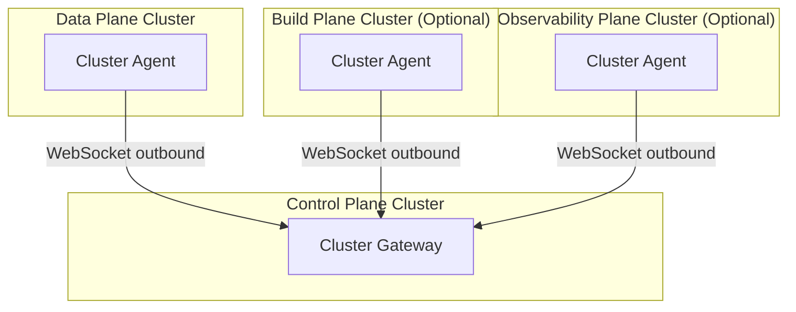

import {versions} from '../_constants.mdx';

# Prerequisites

Before deploying OpenChoreo to production, ensure your environment meets the following requirements.

## Kubernetes Cluster

| Requirement | Specification |
|-------------|---------------|
| Kubernetes Version | 1.32 or later |
| Node Count | Minimum 3 nodes (for high availability) |
| Node Resources | 4 CPU cores, 8 GB RAM per node (minimum) |
| RBAC | Enabled |
| LoadBalancer | Required for external access |
| Storage Classes | At least one default StorageClass for PersistentVolumeClaims |

:::note
For development or testing, a single-node cluster with 8 GB RAM and 4 CPU cores is sufficient. Production deployments should use a multi-node cluster with appropriate resource allocation.
:::

## Required Tools

Install the following tools on your workstation:

| Tool | Version | Notes |
|------|---------|-------|
| [kubectl](https://kubernetes.io/docs/tasks/tools/) | 1.32+ | Kubernetes CLI |
| [Helm](https://helm.sh/docs/intro/install/) | 3.12+ | Package manager |
| [cert-manager](https://cert-manager.io/docs/installation/) | 1.12+ | Required on all clusters where OpenChoreo planes are deployed |

## LoadBalancer Requirements

OpenChoreo services require LoadBalancer with the ability to dynamically assign IPs. In production, each plane exposing services on port 443 needs a separate IP address (since multiple services cannot share the same IP:port combination).

If only a single IP is available, ports can be customized per service. Refer to the [Helm Charts Reference](/docs/reference/helm/control-plane.mdx) for port configuration options.

### IPs and Ports by Plane

**Control Plane:**

| Port | Purpose |
|------|---------|
| 443 | Backstage UI, OpenChoreo API, Identity Provider |
| 80 | HTTP to HTTPS redirect (optional) |

**Data Plane:**

| Port | Purpose |
|------|---------|
| 443 | Application endpoints, deployment invocations |
| 80 | HTTP to HTTPS redirect (optional) |

**Build Plane (Optional):**

- No inbound ports required
- Only outbound connectivity needed (to Control Plane, container registry)

**Observability Plane (Optional):**

| Port | Purpose |
|------|---------|
| 443 | OpenSearch ingestion endpoint |

## Cluster Agent Connectivity

OpenChoreo planes communicate via **Cluster Agents** using WebSocket connections. The agent runs in each remote plane and establishes an outbound connection to the Control Plane's Cluster Gateway.

**Single-Cluster Mode:**
Communication happens via Kubernetes ClusterIP services - no external networking required between planes.

**Multi-Cluster Mode:**
Each plane's cluster agent connects outbound to the Control Plane. Only the Control Plane needs to be reachable from other clusters.

## Domain Requirements

Each plane requires its own domain(s). These do not need to share a common base domain - configure each independently as needed.

| Plane | Domains Required |
|-------|------------------|
| Control Plane | Console UI domain, API domain, Identity Provider domain |
| Data Plane | Application endpoints domain (wildcard for dynamic apps) |
| Build Plane (Optional) | No external domain required |
| Observability Plane (Optional) | OpenSearch/ingestion endpoint domain |

Refer to the [Helm Charts Reference](/docs/reference/helm/control-plane.mdx) for domain configuration options.

:::tip
For local development, you can use `openchoreo.localhost` as the base domain with entries in `/etc/hosts` or a local DNS resolver.
:::

## TLS Certificate Requirements

| Plane | Certificate Type | Domains |
|-------|-----------------|---------|
| Control Plane | Standard (SAN) | Console, API, Identity Provider |
| Data Plane | Wildcard | `*.{apps-domain}` for application endpoints |
| Build Plane (Optional) | None required (internal only) |
| Observability Plane (Optional) | Standard | Ingestion endpoint |

See [TLS & Certificates](./tls-certificates.mdx) for detailed configuration.

## Resource Requirements

### Control Plane

| Component | CPU Request | CPU Limit | Memory Request | Memory Limit |
|-----------|-------------|-----------|----------------|--------------|
| Backstage | 200m | 2000m | 256Mi | 2Gi |
| OpenChoreo API | 100m | 500m | 256Mi | 512Mi |
| Controller Manager | 100m | 500m | 128Mi | 512Mi |
| Cluster Gateway | 100m | 500m | 128Mi | 256Mi |

### Data Plane

| Component | CPU Request | CPU Limit | Memory Request | Memory Limit |
|-----------|-------------|-----------|----------------|--------------|
| KGateway | 100m | 1000m | 128Mi | 512Mi |
| Cluster Agent | 50m | 200m | 64Mi | 128Mi |

### Build Plane (Optional)

| Component | CPU Request | CPU Limit | Memory Request | Memory Limit |
|-----------|-------------|-----------|----------------|--------------|
| Argo Workflows | 100m | 500m | 256Mi | 512Mi |
| Cluster Agent | 50m | 200m | 64Mi | 128Mi |

### Observability Plane (Optional)

| Component | CPU Request | CPU Limit | Memory Request | Memory Limit |
|-----------|-------------|-----------|----------------|--------------|
| OpenSearch | 500m | 2000m | 2Gi | 4Gi |
| Observer | 100m | 500m | 256Mi | 512Mi |
| Cluster Agent | 50m | 200m | 64Mi | 128Mi |

## Storage Requirements

| Plane | Component | Minimum Size |
|-------|-----------|--------------|
| Control Plane | Database | 500Mi |
| Build Plane (Optional) | Workflow artifacts | 10Gi |
| Observability Plane (Optional) | OpenSearch | 50Gi+ |

## Pre-Installation Checklist

Before proceeding with installation:

- [ ] Kubernetes cluster meets version and resource requirements
- [ ] `kubectl` and `helm` are installed and configured
- [ ] LoadBalancer service type is available
- [ ] Storage class is configured for PersistentVolumeClaims
- [ ] Base domain is registered and DNS is configurable
- [ ] TLS certificate strategy is determined (cert-manager or BYOC)
- [ ] Network connectivity between clusters is verified (for multi-cluster)
- [ ] Required ports are accessible through firewalls

## Next Steps

- [TLS & Certificates](./tls-certificates.mdx): Configure TLS for secure communication
- [Deployment Topology](./deployment-topology.mdx): Plan your plane architecture
- [Helm Charts Reference](/docs/reference/helm/control-plane.mdx): Explore all configuration options
