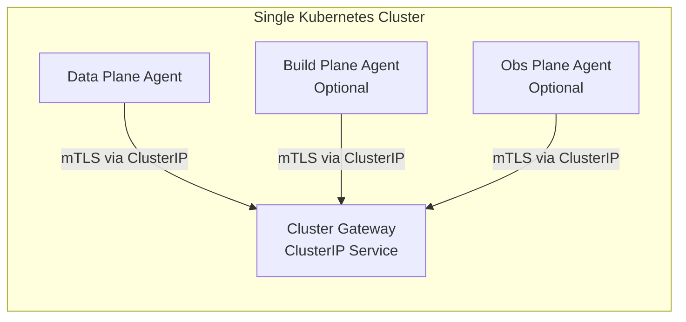
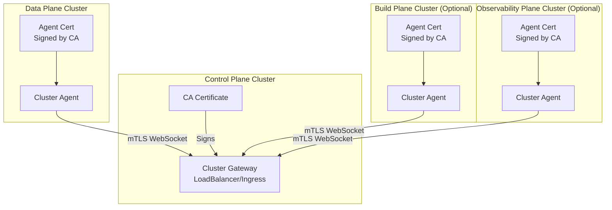

import Tabs from '@theme/Tabs';
import TabItem from '@theme/TabItem';

# TLS & Certificates

OpenChoreo requires TLS certificates for secure communication between components and for exposing services externally. This guide covers certificate requirements and configuration options.

## Certificate Requirements per Plane

Each plane's domains can be configured independently - they do not need to share a base domain.

| Plane | Certificate Type | Example Domains |
|-------|------------------|-----------------|
| Control Plane | Standard (SAN) | `console.example.com`, `api.example.com`, `idp.example.com` |
| Data Plane | Wildcard | `*.apps.example.com` |
| Build Plane (Optional) | Internal only | Self-signed (auto-generated for agent mTLS) |
| Observability Plane (Optional) | Standard | `logs.example.com` |

Refer to [Helm Charts Reference](/docs/reference/helm/control-plane.mdx) for configuring specific domain names.

:::important
The Data Plane requires a **wildcard certificate** because application endpoints are dynamically generated (e.g., `myapp.apps.example.com`). Wildcard certificates can only be issued using DNS-01 challenge, not HTTP-01.
:::

## Configuration Options

<Tabs groupId="tls-strategy">
<TabItem value="cert-manager" label="cert-manager" default>

### Using cert-manager

[cert-manager](https://cert-manager.io/) automates certificate provisioning and renewal. OpenChoreo integrates with cert-manager for TLS certificate management.

#### cert-manager Installation

cert-manager is required on all clusters where OpenChoreo planes are deployed.

```bash
helm repo add jetstack https://charts.jetstack.io
helm repo update
helm install cert-manager jetstack/cert-manager \
  --namespace cert-manager \
  --create-namespace \
  --set crds.enabled=true
```

#### ACME Solvers

cert-manager supports two challenge types for domain validation:

<Tabs groupId="acme-solver">
<TabItem value="dns01" label="DNS-01 (Recommended)" default>

DNS-01 is required for wildcard certificates and works in private networks.

**Create a ClusterIssuer with DNS-01 solver:**

```yaml
apiVersion: cert-manager.io/v1
kind: ClusterIssuer
metadata:
  name: letsencrypt-prod
spec:
  acme:
    server: https://acme-v02.api.letsencrypt.org/directory
    email: your-email@example.com
    privateKeySecretRef:
      name: letsencrypt-prod-account-key
    solvers:
      - dns01:
          cloudflare:
            email: your-cloudflare-email@example.com
            apiTokenSecretRef:
              name: cloudflare-api-token
              key: api-token
```

**Supported DNS providers include:**
- Cloudflare
- Google Cloud DNS
- Azure DNS
- DigitalOcean
- [And many more](https://cert-manager.io/docs/configuration/acme/dns01/)

</TabItem>
<TabItem value="http01" label="HTTP-01">

HTTP-01 works for standard certificates but **cannot issue wildcard certificates**.

**Create a ClusterIssuer with HTTP-01 solver:**

```yaml
apiVersion: cert-manager.io/v1
kind: ClusterIssuer
metadata:
  name: letsencrypt-prod
spec:
  acme:
    server: https://acme-v02.api.letsencrypt.org/directory
    email: your-email@example.com
    privateKeySecretRef:
      name: letsencrypt-prod-account-key
    solvers:
      - http01:
          ingress:
            class: openchoreo-traefik
```

:::warning
HTTP-01 cannot issue wildcard certificates. Use DNS-01 for the Data Plane if you need wildcard certificates for application endpoints.
:::

</TabItem>
</Tabs>

#### Control Plane Configuration

Create a Certificate resource for the Control Plane and reference it in ingress configuration:

```yaml
apiVersion: cert-manager.io/v1
kind: Certificate
metadata:
  name: control-plane-tls
  namespace: openchoreo-control-plane
spec:
  secretName: control-plane-tls
  issuerRef:
    name: letsencrypt-prod
    kind: ClusterIssuer
  dnsNames:
    - example.com
    - api.example.com
    - thunder.example.com
```

#### Data Plane Configuration

Configure the Data Plane gateway with a ClusterIssuer for wildcard certificates:

```yaml
tls:
  clusterIssuer: letsencrypt-prod
  hostname: "*.apps.example.com"
  certName: openchoreo-gateway-tls
```

The gateway will automatically request a wildcard certificate from the specified ClusterIssuer.

#### Build Plane Configuration

If exposing the container registry externally, configure ingress with TLS:

```yaml
registry:
  ingress:
    enabled: true
    className: "your-ingress-class"
    hosts:
      - host: registry.example.com
        paths:
          - path: /
    tls:
      - secretName: registry-tls
        hosts:
          - registry.example.com
```

</TabItem>
<TabItem value="byoc" label="Bring Your Own Certificates">

### Bring Your Own Certificates

If you have existing certificates from your organization's PKI or a commercial CA, you can provide them directly.

#### Certificate Format

Certificates must be in PEM format:
- **Certificate file**: Full certificate chain (server cert + intermediate CAs)
- **Private key**: RSA or ECDSA private key

#### Creating TLS Secrets

Create Kubernetes TLS secrets for each plane:

**Control Plane:**

```bash
kubectl create secret tls control-plane-tls \
  --cert=path/to/fullchain.pem \
  --key=path/to/privkey.pem \
  -n openchoreo-control-plane
```

**Data Plane (wildcard certificate):**

```bash
kubectl create secret tls openchoreo-gateway-tls \
  --cert=path/to/wildcard-fullchain.pem \
  --key=path/to/wildcard-privkey.pem \
  -n openchoreo-data-plane
```

**Build Plane:**

```bash
kubectl create secret tls registry-tls \
  --cert=path/to/registry-fullchain.pem \
  --key=path/to/registry-privkey.pem \
  -n openchoreo-build-plane
```

#### Helm Configuration

Reference the secrets in your Helm values:

**Control Plane:**

```yaml
backstage:
  ingress:
    tls:
      - secretName: control-plane-tls
        hosts:
          - console.example.com
openchoreoApi:
  ingress:
    tls:
      - secretName: control-plane-tls
        hosts:
          - api.example.com
thunder:
  ocIngress:
    tls:
      - secretName: control-plane-tls
        hosts:
          - idp.example.com
```

**Data Plane:**

```yaml
gateway:
  tls:
    clusterIssuer: ""  # Leave empty when using BYOC
    hostname: "*.apps.example.com"
    certName: openchoreo-gateway-tls
```

**Build Plane:**

```yaml
registry:
  ingress:
    tls:
      - secretName: registry-tls
        hosts:
          - registry.example.com
```

#### Certificate Renewal

When using BYOC, you are responsible for certificate renewal. Before certificates expire:

1. Obtain new certificates from your CA
2. Update the Kubernetes secrets:

```bash
kubectl create secret tls control-plane-tls \
  --cert=path/to/new-fullchain.pem \
  --key=path/to/new-privkey.pem \
  -n openchoreo-control-plane \
  --dry-run=client -o yaml | kubectl apply -f -
```

3. Restart affected pods to pick up new certificates (or wait for automatic reload)

</TabItem>
</Tabs>

## Internal mTLS (Cluster Agent Communication)

OpenChoreo uses mutual TLS for secure communication between the Control Plane and remote planes.

**How it works:**

1. Control Plane generates a CA certificate (10-year validity)
2. CA is stored in ConfigMap `cluster-gateway-ca`
3. Each plane's cluster agent generates a client certificate signed by this CA
4. Cluster Gateway validates agent certificates during WebSocket connection

### Single-Cluster Mode



### Multi-Cluster Mode



### Agent Certificate Configuration

```yaml
clusterAgent:
  tls:
    enabled: true
    generateCerts: true
    secretName: cluster-agent-tls
    duration: 2160h      # 90 days
    renewBefore: 360h    # 15 days
```

For multi-cluster, the CA certificate from Control Plane must be provided to other planes:

```yaml
clusterAgent:
  tls:
    enabled: true
    generateCerts: true
    caValue: |
      -----BEGIN CERTIFICATE-----
      ... (CA from Control Plane)
      -----END CERTIFICATE-----
```

## Troubleshooting

### Certificate Not Issued

Check cert-manager logs and Certificate status:

```bash
# Check Certificate status
kubectl get certificate -A

# Describe a specific certificate
kubectl describe certificate control-plane-tls -n openchoreo-control-plane

# Check CertificateRequest
kubectl get certificaterequest -A

# Check cert-manager logs
kubectl logs -n cert-manager deployment/cert-manager
```

### DNS-01 Challenge Failing

Verify DNS provider credentials and permissions:

```bash
# Check ClusterIssuer status
kubectl describe clusterissuer letsencrypt-prod

# Check Challenge resources
kubectl get challenges -A
kubectl describe challenge <challenge-name> -n <namespace>
```

### Wildcard Certificate Issues

- Ensure you're using DNS-01 solver (HTTP-01 cannot issue wildcards)
- Verify DNS provider API credentials have permission to create TXT records
- Check that the DNS zone matches your domain

### Agent Certificate Errors

For cluster agent mTLS issues:

```bash
# Check cluster agent logs
kubectl logs -n openchoreo-data-plane deployment/cluster-agent

# Verify CA ConfigMap exists
kubectl get configmap cluster-gateway-ca -n openchoreo-control-plane

# Check agent certificate
kubectl get certificate cluster-agent-tls -n openchoreo-data-plane
```

## Next Steps

- [Deployment Topology](./deployment-topology.mdx): Configure organizations, environments, and planes
- [Identity Provider Configuration](./identity-configuration.mdx): Set up authentication
- [Helm Charts Reference](/docs/reference/helm/control-plane.mdx): Complete TLS configuration options
