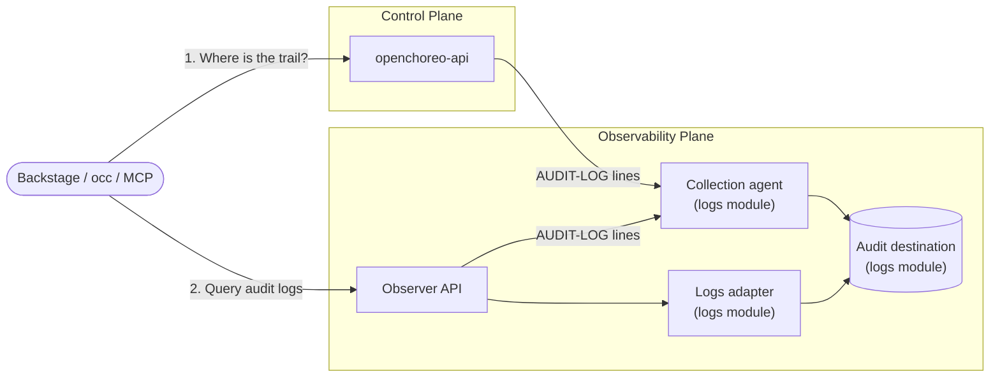

import CodeBlock from "@theme/CodeBlock";
import { versions } from "../_constants.mdx";

# Audit Logging

OpenChoreo keeps an audit trail of who did what, to which resource, from where, and whether it was allowed. Every state-modifying operation on the OpenChoreo API and the Observer API produces an audit record, whether it arrives over REST (the Backstage portal, `occ`, CI) or through an MCP server.

Audit records are a separate signal from logs. They are written to their own index or stream with their own retention, so the trail outlives operational logs and can't be flooded by application output.

## Overview

An audit record answers:

| Question              | Fields                                                                                                                   |
| --------------------- | ------------------------------------------------------------------------------------------------------------------------ |
| **Who**               | `actor.id`, `actor.type`, `actor.issuer`, `actor.session_id`, `actor.entitlements`                                       |
| **Did what**          | `action` (e.g. `create_project`), `operation_id` (e.g. `CreateProject`), `category`                                      |
| **To which resource** | `resource.type`, `resource.namespace`, `resource.environment`, `resource.project`, `resource.component`, `resource.name` |
| **With what outcome** | `result`: `success`, `failure`, `denied` or `unauthenticated`                                                            |
| **From where**        | `source_ip`, `user_agent`, `surface` (`rest` or `mcp`), `producer` (`openchoreo-api` or `observer`)                      |
| **Correlation**       | `event_id`, `event_time`, `request_id`                                                                                   |

Records fall into three categories:

- **`management`**: create, update and delete operations on platform resources such as projects, components, environments and planes.
- **`authorization`**: changes to authorization, meaning roles and role bindings.
- **`access`**: reads worth recording in their own right. Today this is reading the audit trail itself, so an investigator can see who looked.

Other reads are not audited.

## Architecture

Getting an audit record from the API to a query result involves four steps. Each is configured in a different place, and a trail with a missing step stays empty without raising an error.

| Step         | What happens                                                                                                                         | Configured in                                                                                |
| ------------ | ------------------------------------------------------------------------------------------------------------------------------------ | -------------------------------------------------------------------------------------------- |
| **Emit**     | `openchoreo-api` and `observer` write each audit record as a JSON line (`"msg":"AUDIT-LOG"`) to their container output               | Control plane chart `openchoreoApi.config.audit`, observability plane chart `observer.audit` |
| **Collect**  | The logs module's collection agent picks those lines up from trusted containers only and ships them to a dedicated audit destination | Logs module                                                                                  |
| **Query**    | The Observer serves the trail through its logs adapter to the Backstage portal, `occ auditlogs` and the `query_audit_logs` MCP tool  | Nothing extra; requires `auditlogs:view`                                                     |
| **Discover** | The control plane advertises which Observer holds the trail, so clients never need to be told where it lives                         | Control plane chart `openchoreoApi.config.audit.observabilityPlaneRef`                       |



In a single-cluster setup one collection agent collects from both producers. In a multi-cluster setup `openchoreo-api` and `observer` run in different clusters, so **the logs module's collection agent, with audit collection enabled, must run in both the control plane cluster and the observability plane cluster**. Data plane and workflow plane clusters run neither producer and need no audit configuration. See [Multi-cluster setups](#multi-cluster-setups).

## Prerequisites

- An observability plane installed and registered as a `ClusterObservabilityPlane` or `ObservabilityPlane`. See [Getting Started](../getting-started/try-it-out/on-k3d-locally.mdx#step-7-setup-observability-plane-optional) or [Multi-Cluster Connectivity](./multi-cluster-connectivity.mdx#observability-plane).
- A logs module that supports audit logs. Audit logs are currently supported by these logs modules:

  | Module                                                                                                                                                 | Audit destination                     | Default retention |
  | ------------------------------------------------------------------------------------------------------------------------------------------------------ | ------------------------------------- | ----------------- |
  | [observability-logs-opensearch](https://github.com/openchoreo/community-modules/tree/main/observability-logs-opensearch#enable-audit-log-collection)   | Daily `audit-logs-YYYY-MM-DD` indices | 365 days          |
  | [observability-logs-openobserve](https://github.com/openchoreo/community-modules/tree/main/observability-logs-openobserve#enable-audit-log-collection) | `audit_logs` stream                   | 365 days          |

  A module without audit support answers audit queries with `501 Not Implemented`. See [Building a Module](./modules/building-a-module.md#audit-logs).

:::tip[Already enabled on quick installs]
`k3d-install.sh --with-observability` and the quick-start installer's `--with-observability` turn audit logging on for the control plane, the observer and the logs module automatically. The guided [k3d setup](../getting-started/try-it-out/on-k3d-locally.mdx#step-7-setup-observability-plane-optional) enables it as part of its observability plane steps. Use this page to enable it on other installations or to tune it.
:::

## Enabling Audit Logging

Enable collection first so the first records have somewhere to go, then enable emission on the observability plane and the control plane. The commands below use the OpenSearch logs module in its default namespace. For OpenObserve, use the equivalent command from the [module README](https://github.com/openchoreo/community-modules/tree/main/observability-logs-openobserve#enable-audit-log-collection).

:::caution[`--reuse-values` and chart versions]
The commands below use `--reuse-values` to change only the audit settings, which is safe when `--version` matches the version already installed. If you are also upgrading a chart to a new version, pass your full values file with the audit settings added instead: `--reuse-values` carries the old release's computed values over the new chart's defaults.
:::

### Step 1: Collect audit records in the logs module

export const auditCollectionEnable = `helm upgrade observability-logs-opensearch \\
  oci://ghcr.io/openchoreo/helm-charts/observability-logs-opensearch \\
  --namespace openchoreo-observability-plane \\
  --version ${versions.logsOpensearchModule} \\
  --reuse-values \\
  --set auditLogs.enabled=true`;

<CodeBlock language="bash">{auditCollectionEnable}</CodeBlock>

This assumes log collection is already enabled on the module, as set up when the observability plane was installed. `--reuse-values` keeps those collection settings, so only the audit setting changes.

### Step 2: Emit audit records from the Observer

export const auditObserverEnable = `helm upgrade openchoreo-observability-plane ${versions.helmSource}/openchoreo-observability-plane \\
  --version ${versions.helmChart} \\
  --namespace openchoreo-observability-plane \\
  --reuse-values \\
  --set observer.audit.enabled=true`;

<CodeBlock language="bash">{auditObserverEnable}</CodeBlock>

### Step 3: Emit audit records from the control plane

Point `observabilityPlaneRef` at the registered observability plane whose logs module collects the trail. For a `ClusterObservabilityPlane` named `default`:

export const auditControlPlaneEnable = `helm upgrade openchoreo-control-plane ${versions.helmSource}/openchoreo-control-plane \\
  --version ${versions.helmChart} \\
  --namespace openchoreo-control-plane \\
  --reuse-values \\
  --set openchoreoApi.config.audit.enabled=true \\
  --set openchoreoApi.config.audit.observabilityPlaneRef.kind=ClusterObservabilityPlane \\
  --set openchoreoApi.config.audit.observabilityPlaneRef.name=default`;

<CodeBlock language="bash">{auditControlPlaneEnable}</CodeBlock>

For a namespace-scoped `ObservabilityPlane`, set `kind=ObservabilityPlane` and also set `openchoreoApi.config.audit.observabilityPlaneRef.namespace`.

:::warning
`openchoreo-api` refuses to start when `audit.enabled` is `true` and `observabilityPlaneRef.kind` or `observabilityPlaneRef.name` is empty.

The reference itself is resolved only when a client asks where the trail lives. If it names a plane that doesn't exist, the API starts normally, logs a warning, and clients can't find the trail. Records are still written to the API server's output, so nothing is lost as long as collection is enabled.
:::

### Step 4: Verify

Make a change, for example create and delete a project, then check each step:

1. **Emit**: the API server writes an `AUDIT-LOG` line:

   ```bash
   kubectl logs -n openchoreo-control-plane deployment/openchoreo-api -c api-server | grep AUDIT-LOG
   ```

2. **Query**: the record is returned by the Observer:

   ```bash
   occ auditlogs --since 1h
   ```

3. **Portal**: signed in as a user with `auditlogs:view`, open **Audit Logs** from the Backstage sidebar.

## Multi-Cluster Setups

When the control plane and the observability plane run in separate clusters:

| Cluster             | What to configure                                                                                                                                                                                                                       |
| ------------------- | --------------------------------------------------------------------------------------------------------------------------------------------------------------------------------------------------------------------------------------- |
| Control plane       | `openchoreoApi.config.audit.*` as in [Step 3](#step-3-emit-audit-records-from-the-control-plane). Install the logs module with **only its collection agent** enabled, pointed at the observability plane, with audit collection enabled |
| Observability plane | `observer.audit.enabled=true` as in [Step 2](#step-2-emit-audit-records-from-the-observer), and audit collection on the logs module as in [Step 1](#step-1-collect-audit-records-in-the-logs-module)                                    |
| Data plane          | Nothing. No audit producer runs here                                                                                                                                                                                                    |
| Workflow plane      | Nothing                                                                                                                                                                                                                                 |

The exact settings for the control plane cluster depend on the logs module and on how the observability plane exposes its ingestion endpoint. Follow the module's multi-cluster instructions:

- [OpenSearch: Multi-cluster audit collection](https://github.com/openchoreo/community-modules/tree/main/observability-logs-opensearch#multi-cluster-audit-collection)
- [OpenObserve: Multi-cluster audit collection](https://github.com/openchoreo/community-modules/tree/main/observability-logs-openobserve#multi-cluster-audit-collection)

Each record carries the `openchoreo_cluster_instance` of the cluster it was collected in.

## Trusted Producers

A logs module must accept audit records only from trusted producers. The OpenSearch and OpenObserve modules configure this as an allowlist of containers, `auditLogs.producers`. The defaults are:

```yaml
auditLogs:
  producers:
    - producer: openchoreo-api
      namespace: openchoreo-control-plane
      container: api-server
    - producer: observer
      namespace: openchoreo-observability-plane
      container: observer
```

Entries are matched against the container log file name that the kubelet writes, not against the content of the log line. A workload outside the list that prints a line shaped like an audit record ends up in the ordinary container logs, never in the audit trail.

:::warning

- **Each entry grants a workload the right to write into the audit trail.** Review additions accordingly.
- **Installing the control plane or observability plane into a non-default namespace requires editing these entries.** Otherwise collection stops silently: nothing errors and the trail stays empty.
- The API server's container is named `api-server`, not `openchoreo-api`.

:::

## Configuring What Is Published

By default every audited operation is published. Policies let you suppress noise, for example a CI service account that updates workloads hundreds of times a day, or publish only selected operations.

Policies are configured separately, with the same syntax, for the control plane (`openchoreoApi.config.audit`) and for the Observer (`observer.audit`):

| Key                | Default | Description                                                                                   |
| ------------------ | ------- | --------------------------------------------------------------------------------------------- |
| `defaults.publish` | `true`  | Whether an operation that matches no policy is published                                      |
| `policies`         | `[]`    | Ordered list of `{match, set}` rules. The first rule whose `match` fits the operation applies |

`set` accepts a single key, `publish`. Every field in `match` is a list. A field matches when any of its values matches, and a rule matches when all of its non-empty fields match.

| `match` field  | Values                                                                                                                 | Checked at startup |
| -------------- | ---------------------------------------------------------------------------------------------------------------------- | ------------------ |
| `categories`   | `management`, `authorization`                                                                                          | Yes                |
| `resources`    | Resource types, e.g. `project`, `component`, `workload`, `releasebinding`, `authzrolebinding`                          | Yes                |
| `operations`   | Operation IDs, e.g. `CreateProject`, `UpdateComponent`                                                                 | Yes                |
| `actions`      | Action names, e.g. `create_project`, `delete_project`                                                                  | Yes                |
| `surfaces`     | `rest`, `mcp`                                                                                                          | Yes                |
| `actor_types`  | `user`, `anonymous`, and each subject type configured for the service (e.g. `service_account`)                         | Yes                |
| `results`      | `success`, `failure`, `denied`, `unauthenticated`                                                                      | Yes                |
| `actors`       | Actor IDs, the claim set by `actor.idClaim`                                                                            | No                 |
| `entitlements` | Entitlement values such as group names. Matched against the values of every entitlement claim, whatever the claim name | No                 |

Resource types, operation IDs and action names differ between the two services. Values that the service doesn't produce are rejected at startup, and the error message lists the accepted values.

:::important[Policy keys use snake_case]
Helm passes `policies` to the service configuration unchanged, so write `actor_types`, not `actorTypes`. A list can't be set with `--set`. Use a values file (`-f`) or `--set-json`.
:::

### Examples

**Suppress successful workload updates from a CI service account** (control plane values file):

```yaml
openchoreoApi:
  config:
    audit:
      policies:
        - match:
            actor_types: [service_account]
            resources: [workload]
            results: [success]
          set:
            publish: false
```

Denied and failed calls from the same account are still published because they don't match `results: [success]`.

**Publish only authorization changes and anything that was refused** (allowlist mode):

```yaml
openchoreoApi:
  config:
    audit:
      defaults:
        publish: false
      policies:
        - match:
            categories: [authorization]
          set:
            publish: true
        - match:
            results: [denied, unauthenticated]
          set:
            publish: true
```

**Always publish one sensitive operation, even if a later rule suppresses its resource type**:

```yaml
openchoreoApi:
  config:
    audit:
      policies:
        - match:
            operations: [DeleteProject]
          set:
            publish: true
        - match:
            resources: [project]
            actor_types: [service_account]
          set:
            publish: false
```

### Rules Enforced at Startup

A configuration that breaks one of these rules stops the service from starting, with an error naming the rule:

- A rule must set `publish`.
- A rule with an empty `match` can't set `publish: false`, because it would silence every event.
- `actors` and `entitlements` can raise publishing (`publish: true`) but can't be used to suppress it. Hiding one person's actions is exactly what an audit trail must not allow.
- `set.category` is rejected. The category is fixed by the operation.
- `match.categories` accepts only `management` and `authorization`. The `access` category can't be used as a selector.

:::warning[Allowlist mode fails closed]
With `defaults.publish: false`, only operations matched by a `publish: true` rule are recorded. Selector values are validated, but a rule that is valid yet narrower than intended silently drops events. Check the trail after changing policies.
:::

## Actor Identity

`actor.id` holds the value of one token claim, `sub` by default. Set `actor.idClaim` to record a more readable identifier, such as an email claim your identity provider issues:

```yaml
openchoreoApi:
  config:
    audit:
      actor:
        idClaim: email
```

```yaml
observer:
  audit:
    actor:
      idClaim: email
```

Use the same claim on both services. The same value is matched by `policies[].match.actors` and by `occ auditlogs --actor`.

An ID is unique only within its issuer (`actor.issuer`). With more than one identity provider configured, filter by issuer as well as actor (`occ auditlogs --actor <id> --issuer <issuer>`). Tokens issued through the client credentials flow carry no session, so `actor.session_id` is empty for service accounts.

## Access to the Audit Trail

Reading the trail requires the **`auditlogs:view`** action, evaluated at **cluster scope**. The Backstage portal, `occ auditlogs` and the `query_audit_logs` MCP tool all enforce it.

Of the default roles, `admin` and `platform-engineer` include it. `developer`, `sre` and the reader roles don't. Namespace, project and component filters narrow the results but never grant access: a user who can manage a project can't read that project's audit trail without `auditlogs:view`.

To give an auditor read-only access, bind a `ClusterAuthzRole` that contains the action:

```yaml
apiVersion: openchoreo.dev/v1alpha1
kind: ClusterAuthzRole
metadata:
  name: auditor
spec:
  actions:
    - "auditlogs:view"
```

See [Custom Roles and Bindings](./authorization/custom-roles.mdx) to bind it to a group, or [Customizing Bootstrap Roles and Bindings](./authorization.md#customizing-bootstrap-roles-and-bindings) to create it at install time.

Reading the trail is itself recorded with category `access` and action `read_audit_log`.

## Viewing the Audit Trail

| Client               | How                                                                                                                                      |
| -------------------- | ---------------------------------------------------------------------------------------------------------------------------------------- |
| **Backstage portal** | **Audit Logs** in the sidebar                                                                                                            |
| **CLI**              | `occ auditlogs`. See the [CLI reference](../reference/cli-reference.md#auditlogs)                                                        |
| **MCP**              | `query_audit_logs` on the Observability Plane MCP server. See [MCP Servers](../reference/mcp-servers.mdx#observability-plane-mcp-server) |
| **API**              | `POST /api/v1alpha1/audit-logs/query` on the Observer                                                                                    |

None of the clients needs to be told which Observer holds the trail. They ask the control plane, which resolves `observabilityPlaneRef`.

Queries cover at most 366 days at a time and return records newest first. Within a filter, values are OR-ed. Separate filters are AND-ed.

```bash
# Denied requests in the last 7 days
occ auditlogs --since 7d --result denied,unauthenticated

# Everything one user changed in a namespace
occ auditlogs --actor alice@example.com --namespace acme-corp --category management
```

## Retention and Storage

Retention and the storage location are properties of the logs module:

- **OpenSearch**: `openSearchSetup.dataRetentionTime.auditLogs` (default `365d`), index prefix `auditLogs.indexPrefix` (default `audit-logs-`).
- **OpenObserve**: `openObserveSetup.auditLogsRetentionDays` (default `365`), stream `common.openObserveAuditStream` (default `audit_logs`).

Both modules can also ship audit records to a separate backend with `auditLogs.output.*`, for example one shared audit store for several observability planes. See the [OpenSearch](https://github.com/openchoreo/community-modules/tree/main/observability-logs-opensearch#configuring-the-audit-destination) and [OpenObserve](https://github.com/openchoreo/community-modules/tree/main/observability-logs-openobserve#configuration) READMEs.

## Configuration Reference

### Control Plane (`openchoreoApi.config.audit`)

| Value                             | Default | Description                                                                                   |
| --------------------------------- | ------- | --------------------------------------------------------------------------------------------- |
| `enabled`                         | `false` | Emit audit records from `openchoreo-api`                                                      |
| `observabilityPlaneRef.kind`      | `""`    | `ClusterObservabilityPlane` or `ObservabilityPlane`. Required when `enabled` is `true`        |
| `observabilityPlaneRef.name`      | `""`    | Name of the plane. Required when `enabled` is `true`                                          |
| `observabilityPlaneRef.namespace` | `""`    | Namespace of an `ObservabilityPlane`. Not used for `ClusterObservabilityPlane`                |
| `defaults.publish`                | `true`  | Publish operations that match no policy                                                       |
| `policies`                        | `[]`    | Ordered publishing rules. See [Configuring What Is Published](#configuring-what-is-published) |
| `actor.idClaim`                   | `sub`   | Token claim recorded as `actor.id`                                                            |

### Observability Plane (`observer.audit`)

| Value              | Default | Description                             |
| ------------------ | ------- | --------------------------------------- |
| `enabled`          | `false` | Emit audit records from `observer`      |
| `defaults.publish` | `true`  | Publish operations that match no policy |
| `policies`         | `[]`    | Ordered publishing rules                |
| `actor.idClaim`    | `sub`   | Token claim recorded as `actor.id`      |

### Logs Module (OpenSearch and OpenObserve)

Logs module settings are defined by each module. Both currently supported modules share these keys:

| Value                 | Default          | Description                                                             |
| --------------------- | ---------------- | ----------------------------------------------------------------------- |
| `auditLogs.enabled`   | `false`          | Route audit records to their own index or stream                        |
| `auditLogs.producers` | API and Observer | Trusted-producer allowlist. See [Trusted Producers](#trusted-producers) |
| `auditLogs.output.*`  | unset            | Ship audit records to a separate backend                                |

## Troubleshooting

### `openchoreo-api` fails to start after enabling audit

- `observability_plane_ref.kind` or `observability_plane_ref.name` is required: set `openchoreoApi.config.audit.observabilityPlaneRef`.
- An error under `audit.policies[N]`: a policy breaks a [startup rule](#rules-enforced-at-startup), or a `match` value isn't one the service produces. The error lists the accepted values.

### `AUDIT-LOG` lines are written, but the trail is empty

- **Collection not enabled where the producer runs.** In a multi-cluster setup, the logs module's collection agent with audit collection enabled must run in the control plane cluster as well as the observability plane cluster.
- **Non-default namespaces.** The trusted-producer allowlist (`auditLogs.producers` in the OpenSearch and OpenObserve modules) still names `openchoreo-control-plane` and `openchoreo-observability-plane`. See [Trusted Producers](#trusted-producers).
- **OpenSearch index created before its template.** An `audit-logs-*` index created before the module applied its index template gets dynamic mappings and returns no results. See the [OpenSearch module README](https://github.com/openchoreo/community-modules/tree/main/observability-logs-opensearch#configuring-the-audit-destination).
- **Separate destination without credentials.** With `auditLogs.output.host` set, the OpenSearch and OpenObserve modules need the `opensearch-audit-credentials` or `openobserve-audit-credentials` Secret. Their collection agent (Fluent Bit) logs `is used but not set` when it is missing.

### `occ auditlogs` reports that audit logging is not enabled, or that no observer serves it

- `audit logging is not enabled on this OpenChoreo installation`: `openchoreoApi.config.audit.enabled` is `false`.
- `audit logging is enabled, but the control plane advertises no observer serving it`: `observabilityPlaneRef` names a plane that doesn't exist. Look for `Audit observability plane not found` in the `openchoreo-api` logs, and check the plane with `kubectl get clusterobservabilityplane`.

### `403 Forbidden` when querying

The user lacks `auditlogs:view` at cluster scope. A namespace or project role binding is not enough. See [Access to the Audit Trail](#access-to-the-audit-trail).

### `501 Not Implemented` when querying

The logs module in the observability plane doesn't support audit queries.

## Related Documentation

- [Observability & Alerting](./observability-alerting.mdx): the observability plane and its modules
- [Multi-Cluster Connectivity](./multi-cluster-connectivity.mdx): connecting planes across clusters
- [Authorization](./authorization/overview.md): roles, bindings and actions
- [Building a Module](./modules/building-a-module.md#audit-logs): implementing audit support in a logs module
- [CLI Reference: auditlogs](../reference/cli-reference.md#auditlogs)
- [MCP Servers](../reference/mcp-servers.mdx#observability-plane-mcp-server)
