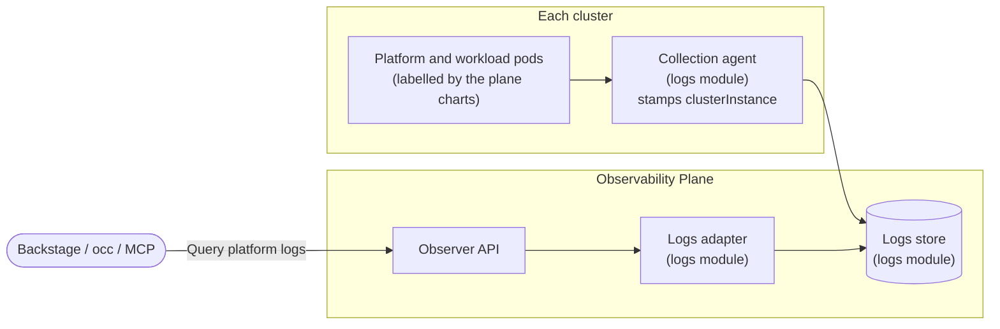

import CodeBlock from "@theme/CodeBlock";
import { versions } from "../_constants.mdx";

# Platform Logs

Platform logs give platform engineers one place to read the logs of the platform itself: the control plane's controller-manager, openchoreo-api and cluster-gateway, the cluster agents and gateways of each plane, the workflow and observability plane infrastructure, and the third-party components installed alongside them, such as cert-manager and OpenBao. Debugging a stuck reconcile or a crash-looping agent no longer means running `kubectl logs` against each cluster.

Platform logs are addressed by raw Kubernetes coordinates, meaning cluster, namespace, pod, container and pod labels, rather than by projects and components. They are a platform engineer's tool. Developers read their components' logs from the component pages. See [Logs and Troubleshooting](../developer-guide/deploying-applications/logs-and-troubleshooting.md).

## Overview

A platform log entry carries:

| Field                       | Description                                                                                     |
| --------------------------- | ----------------------------------------------------------------------------------------------- |
| `timestamp`, `level`, `log` | When it was written, its detected level (`DEBUG`, `INFO`, `WARN`, `ERROR`) and the raw log line |
| `clusterInstance`           | The cluster it was collected from, as named on that cluster's logs collector                    |
| `namespaceName`, `podName`  | The Kubernetes namespace and pod that wrote it                                                  |
| `containerName`             | The container within the pod                                                                    |
| `podIp`, `nodeName`         | Where the pod ran                                                                               |
| `containerImage`            | The image the container ran                                                                     |
| `labels`                    | The pod's labels, including the OpenChoreo [plane labels](#identifying-platform-components)     |

The store holds everything the logs collector sees, not only OpenChoreo's components. That includes user workloads in `dp-*` namespaces, which is why access requires a dedicated, cluster-scoped permission. See [Access to Platform Logs](#access-to-platform-logs).

## Architecture

Platform logs reuse the logs pipeline that already serves component logs. There is no separate collector, index or feature flag.

| Step        | What happens                                                                                                                                      | Configured in                                         |
| ----------- | ------------------------------------------------------------------------------------------------------------------------------------------------- | ----------------------------------------------------- |
| **Label**   | The OpenChoreo plane charts stamp `openchoreo.dev/plane` and `openchoreo.dev/plane-id` on the pods they create                                    | Nothing extra; set by the plane charts                |
| **Collect** | The logs module's collection agent (Fluent Bit) tails every container except those in `kube-system`, and stamps each record with the cluster name | Logs module `fluentBitCustomizations.clusterInstance` |
| **Store**   | Records land in the same store as component logs, with the same retention                                                                         | Logs module                                           |
| **Query**   | The Observer of an observability plane serves the records it holds to the Backstage portal, `occ` and the `query_platform_logs` MCP tool          | Nothing extra; requires `platformlogs:view`           |



Each observability plane answers only for the logs it stores. Clients pick the observability plane to query. The portal offers a plane selector, and `occ` takes the plane name as an argument. There is no search across observability planes.

## Prerequisites

- An observability plane installed and registered as a `ClusterObservabilityPlane` or `ObservabilityPlane`. See [Getting Started](../getting-started/try-it-out/on-k3d-locally.mdx#step-7-setup-observability-plane-optional) or [Multi-Cluster Connectivity](./multi-cluster-connectivity.mdx#observability-plane).
- Log collection enabled on the logs module (e.g: `fluent-bit.enabled=true`).
- A logs module that supports platform logs:

  | Module                                                                                                                     | Minimum version |
  | -------------------------------------------------------------------------------------------------------------------------- | --------------- |
  | [observability-logs-opensearch](https://github.com/openchoreo/community-modules/tree/main/observability-logs-opensearch)   | 0.6.0           |
  | [observability-logs-openobserve](https://github.com/openchoreo/community-modules/tree/main/observability-logs-openobserve) | 0.7.0           |

  A module without platform logs support answers queries with `501 Not Implemented`. See [Building a Module](./modules/building-a-module.md#platform-logs).

- OpenChoreo v1.3 or later on the planes whose components you want to identify by [plane labels](#identifying-platform-components). Older plane charts don't set the labels, but their pods are still queryable by namespace and pod.

:::tip[Already enabled on quick installs]
`k3d-install.sh --with-observability` and the quick-start installer's `--with-observability` set the cluster name on the logs collector, and the default `platform-engineer` and `admin` roles already include `platformlogs:view`. On those installations, open **Platform → Logs** in the portal as a platform engineer. Use this page to enable platform logs on other installations.
:::

## Enabling Platform Logs

### Step 1: Name the cluster on the logs collector

Set `fluentBitCustomizations.clusterInstance` on the logs module. The collector stamps it on every record as the cluster the record came from. It is required whenever log collection is enabled, and the chart refuses to render without it.

export const clusterInstanceEnable = `helm upgrade observability-logs-opensearch \\
  oci://ghcr.io/openchoreo/helm-charts/observability-logs-opensearch \\
  --namespace openchoreo-observability-plane \\
  --version ${versions.logsOpensearchModule} \\
  --reuse-values \\
  --set fluent-bit.enabled=true \\
  --set fluentBitCustomizations.clusterInstance=openchoreo`;

<CodeBlock language="bash">{clusterInstanceEnable}</CodeBlock>

Use a value that is unique among the clusters reporting to the same observability plane. The plane charts default `planeID` to `default`, so the cluster name is the only way to tell two clusters with default settings apart.

:::caution[`--reuse-values` and chart versions]
`--reuse-values` is safe when `--version` matches the version already installed. If you are also upgrading the module to a new version, use `--reset-then-reuse-values` or pass your full values file instead. See [Upgrades](./upgrades/overview.mdx).
:::

### Step 2: Grant access

Bind `platformlogs:view` to the people who need it. The default `platform-engineer` and `admin` roles already include it. See [Access to Platform Logs](#access-to-platform-logs).

### Step 3: Verify

```bash
occ clusterobservabilityplane logs default --selector openchoreo.dev/plane=controlplane --since 10m
```

The command prints recent control plane log lines. In the portal, open **Platform** in the sidebar and select the **Logs** tab.

## Identifying Platform Components

The OpenChoreo plane charts label the pods they create, so platform components can be selected by label regardless of the namespace they were installed into:

| Label                     | Values                                                             | Set on                                      |
| ------------------------- | ------------------------------------------------------------------ | ------------------------------------------- |
| `openchoreo.dev/plane`    | `controlplane`, `dataplane`, `workflowplane`, `observabilityplane` | Pods created by each plane chart            |
| `openchoreo.dev/plane-id` | The plane's `clusterAgent.planeID` (default `default`)             | Data, workflow and observability plane pods |

The control plane is a singleton and carries no `plane-id`. Components that OpenChoreo doesn't ship, including third-party infrastructure and user workloads, carry no plane label. Find them by namespace, pod or their own labels.

Useful selectors:

| To see                                    | Filter                                                             |
| ----------------------------------------- | ------------------------------------------------------------------ |
| All control plane components              | `openchoreo.dev/plane=controlplane`                                |
| One data plane instance                   | `openchoreo.dev/plane=dataplane,openchoreo.dev/plane-id=<planeID>` |
| Workflow plane infrastructure (Argo etc.) | `openchoreo.dev/plane=workflowplane`                               |
| OpenBao                                   | `app.kubernetes.io/name=openbao`                                   |
| cert-manager                              | Namespace `cert-manager`                                           |

:::note[Workflow plane `planeID`]
Argo Workflows pods get their plane labels from `argo-workflows.commonLabels` in the workflow plane chart. If you set a non-default `clusterAgent.planeID`, set `argo-workflows.commonLabels["openchoreo.dev/plane-id"]` to the same value. The chart fails to render when the two differ.
:::

## Multi-Cluster Setups

Every cluster whose logs you want to read runs its own collection agent, and each agent names its cluster with its own `fluentBitCustomizations.clusterInstance`:

| Cluster                       | What to configure                                                                                                                                                                                                                                                                                                     |
| ----------------------------- | --------------------------------------------------------------------------------------------------------------------------------------------------------------------------------------------------------------------------------------------------------------------------------------------------------------------- |
| Observability plane           | The logs module with collection enabled and `clusterInstance` set, as in [Step 1](#step-1-name-the-cluster-on-the-logs-collector)                                                                                                                                                                                     |
| Data plane and workflow plane | The logs module with **only its collection agent** enabled, pointed at the observability plane, with its own `clusterInstance`. See the module's multi-cluster instructions, for example [OpenSearch](https://github.com/openchoreo/community-modules/tree/main/observability-logs-opensearch#multi-cluster-topology) |
| Control plane                 | The same, if you want control plane logs. Without a collection agent in the control plane cluster, its components are not collected                                                                                                                                                                                   |

Filter by cluster with `--cluster` in `occ`, the cluster filter in the portal, or the `clusterInstance` parameter of the API.

With more than one observability plane, each one serves only the logs its own clusters send it. To keep a region's platform logs in that region, point that region's collectors at the regional observability plane and query that plane.

## Access to Platform Logs

Reading platform logs requires the **`platformlogs:view`** action, evaluated at **cluster scope**. The Backstage portal, `occ` and the `query_platform_logs` MCP tool all enforce it. The Backstage permission is `openchoreo.platformlogs.view`.

Of the default roles, `admin` and `platform-engineer` include it. `developer`, `sre` and the reader roles don't. A namespace-scoped role binding never grants it, and Kubernetes namespaces in a query are not mapped to OpenChoreo namespaces.

:::warning
`platformlogs:view` returns entries with no ownership check. Because the store also holds user workloads, the permission effectively grants read access to **every log the observability plane collects**, including the logs of every component in every project. Grant it only to roles that already have platform-wide access.
:::

To grant it on its own, bind a `ClusterAuthzRole` that contains the action:

```yaml
apiVersion: openchoreo.dev/v1alpha1
kind: ClusterAuthzRole
metadata:
  name: platform-log-reader
spec:
  actions:
    - "platformlogs:view"
```

See [Custom Roles and Bindings](./authorization/custom-roles.mdx) to bind it to a group, or [Customizing Bootstrap Roles and Bindings](./authorization.md#customizing-bootstrap-roles-and-bindings) to create it at install time.

## Viewing Platform Logs

| Client               | How                                                                                                                                                                                       |
| -------------------- | ----------------------------------------------------------------------------------------------------------------------------------------------------------------------------------------- |
| **Backstage portal** | **Platform** in the sidebar, then the **Logs** tab                                                                                                                                        |
| **CLI**              | `occ clusterobservabilityplane logs <name>` or `occ observabilityplane logs <name> -n <namespace>`. See the [CLI reference](../reference/cli-reference.md#clusterobservabilityplane-logs) |
| **MCP**              | `query_platform_logs` on the Observability Plane MCP server. See [MCP Servers](../reference/mcp-servers.mdx#observability-plane-mcp-server)                                               |
| **API**              | `GET /api/v1alpha1/platform-logs` on the Observer                                                                                                                                         |

Within a filter, values are OR-ed. Separate filters are AND-ed. The label selector is the exception: like `kubectl -l`, a comma inside it means AND, and only equality selectors (`key=value`) are accepted.

### Backstage portal

The **Logs** tab under **Platform** opens on the first observability plane, with the last 10 minutes of control plane logs (`openchoreo.dev/plane=controlplane`). Remove the label chip to search everything the plane holds.

- **Observability plane**: the plane whose Observer is queried.
- **Filters**: cluster, namespace, pod and container, each offering the values found in the current time range, plus labels and log levels.
- **Search**, **time range**, **refresh** and **live tail**.

Filters are kept in the page URL, so a filtered view can be shared as a link.

### CLI

```bash
# Control plane components over the last 10 minutes
occ clusterobservabilityplane logs default --selector openchoreo.dev/plane=controlplane --since 10m

# A single container, followed
occ cop logs default --pod-namespace openchoreo-control-plane --container manager -f

# Errors from two clusters, as JSON (one entry per line)
occ cop logs default --cluster cluster-a,cluster-b --level ERROR -o json

# One data plane instance
occ cop logs default -l openchoreo.dev/plane=dataplane,openchoreo.dev/plane-id=eu-1
```

`--pod-namespace` filters by the pods' Kubernetes namespace. For a namespace-scoped `ObservabilityPlane`, `-n` names the OpenChoreo namespace that holds the plane resource. `--since` defaults to `1h` and accepts at most 30 days.

### API

`GET /api/v1alpha1/platform-logs` on the Observer takes:

| Parameter                                                  | Description                                                                          |
| ---------------------------------------------------------- | ------------------------------------------------------------------------------------ |
| `startTime`, `endTime`                                     | Required. RFC 3339 timestamps; `endTime` is exclusive. The window is at most 30 days |
| `clusterInstance`, `namespace`, `podName`, `containerName` | Comma-separated lists, up to 20 values each                                          |
| `labels`                                                   | Equality-based label selector over pod labels, up to 256 characters                  |
| `logLevels`                                                | Comma-separated: `DEBUG`, `INFO`, `WARN`, `ERROR`                                    |
| `searchPhrase`                                             | Text the message must contain, up to 256 characters                                  |
| `limit`                                                    | 1 to 1000, default 100                                                               |
| `sortOrder`                                                | `asc` or `desc` (default)                                                            |

The response holds `logs`, `total` and `tookMs`. `total` counts at most 1000 matches.

`GET /api/v1alpha1/platform-logs/filter-values` returns the distinct values of one field (`filter`: `clusterInstance`, `namespace`, `podName` or `containerName`), with a count for each, under the same filters. The portal uses it to fill its filter drop-downs.

## Retention and Storage

Platform logs share the store and the retention of component logs. On the OpenSearch module this is `openSearchSetup.dataRetentionTime.containerLogs` (default `30d`). There is no separate retention for platform logs.

`kube-system` is never collected, so platform logs don't cover CoreDNS, kube-proxy, the CNI or the Kubernetes API server.

:::note[Logs collected before logs-opensearch 0.6.0]
Records indexed by an earlier version of the OpenSearch module predate the cluster name and the full label mapping. For those records, `clusterInstance` filters never match, and label filters match only the labels the earlier version indexed. Namespace, pod and container filters work as usual. The gap closes as the old indices reach the end of their retention.
:::

## Troubleshooting

### `fluentBitCustomizations.clusterInstance is required` on install or upgrade

The logs module version you are installing supports platform logs and needs the cluster name. Set it as in [Step 1](#step-1-name-the-cluster-on-the-logs-collector).

### `403 Forbidden` when querying

The user lacks `platformlogs:view` at cluster scope. A namespace or project role binding is not enough. See [Access to Platform Logs](#access-to-platform-logs).

### `501 Not Implemented` when querying

The logs module in the queried observability plane doesn't support platform logs. Upgrade to a [supported module](#prerequisites).

### A component is missing from the results

- **No plane label.** Only pods created by the OpenChoreo plane charts carry `openchoreo.dev/plane`. Remove the label filter and filter by namespace or pod instead.
- **Not collected.** The cluster has no collection agent, as with a control plane cluster in a multi-cluster setup, or the pod runs in `kube-system`.
- **Wrong observability plane.** Each plane serves only the logs its clusters send it. Select the plane that the cluster's collector ships to.
- **Cluster filter on old records.** Records collected before `clusterInstance` was set don't carry it. See [Retention and Storage](#retention-and-storage).

## Related Documentation

- [Observability & Alerting](./observability-alerting.mdx): the observability plane and its modules
- [Audit Logging](./audit-logging.mdx): who changed what on the platform
- [Multi-Cluster Connectivity](./multi-cluster-connectivity.mdx): connecting planes across clusters
- [Authorization](./authorization/overview.md): roles, bindings and actions
- [Building a Module](./modules/building-a-module.md#platform-logs): implementing platform logs support in a logs module
- [MCP Servers](../reference/mcp-servers.mdx#observability-plane-mcp-server)
