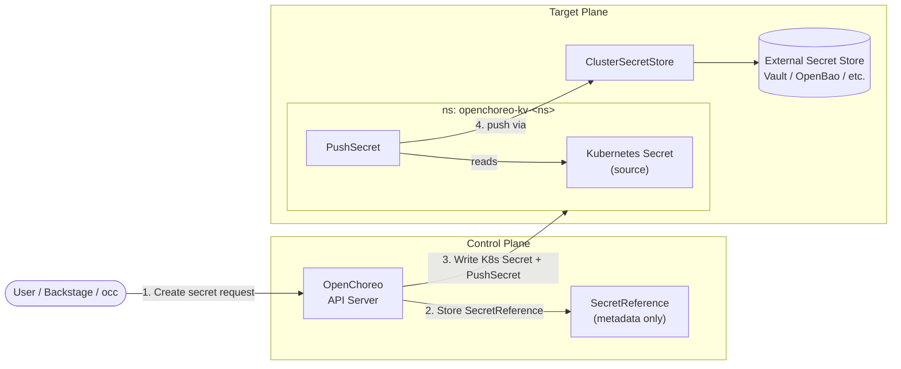

import CodeBlock from "@theme/CodeBlock";
import { versions } from "../_constants.mdx";

# Secret Management

OpenChoreo integrates with [External Secrets Operator (ESO)](https://external-secrets.io/) to synchronize secrets from external secret stores into Kubernetes. This integration allows you to:

- **Bring your own secret store**: Use any ESO-supported backend (HashiCorp Vault, AWS Secrets Manager, Azure Key Vault, GCP Secret Manager, and many more)
- **Use existing External Secrets setup**: If you already have ESO deployed, OpenChoreo can work with your existing `ClusterSecretStore` configurations
- **Centralized secret management**: Manage all secrets in your preferred external store and let ESO sync them to Kubernetes

## Installing External Secrets Operator

ESO must be installed as a standalone prerequisite before installing any OpenChoreo plane charts. Install it in its own namespace:

```bash
helm upgrade --install external-secrets oci://ghcr.io/external-secrets/charts/external-secrets \
    --namespace external-secrets \
    --create-namespace \
    --version 2.0.1 \
    --set installCRDs=true
```

Wait for ESO to be ready:

```bash
kubectl wait --for=condition=available deployment/external-secrets -n external-secrets --timeout=180s
```

:::tip Multi-Cluster
For multi-cluster deployments, install ESO in each cluster where you need secret synchronization.
:::

## Using Your Existing External Secrets Setup

If you already have External Secrets Operator deployed in your cluster with a configured `ClusterSecretStore`, you can skip enabling ESO in the OpenChoreo charts and simply reference your existing store.

Configure your DataPlane to use your existing SecretStore:

```yaml
apiVersion: openchoreo.dev/v1alpha1
kind: DataPlane
metadata:
  name: default
  namespace: my-namespace
spec:
  secretStoreRef:
    name: your-existing-secret-store
  # ... other configuration
```

## Configuring a ClusterSecretStore

To connect ESO to your secret backend, create a `ClusterSecretStore` resource. For provider-specific configuration (authentication methods, endpoints, etc.), refer to the official ESO provider documentation:

- **[HashiCorp Vault](https://external-secrets.io/latest/provider/hashicorp-vault/)**
- **[AWS Secrets Manager](https://external-secrets.io/latest/provider/aws-secrets-manager/)**
- **[GCP Secret Manager](https://external-secrets.io/latest/provider/google-secrets-manager/)**
- **[Azure Key Vault](https://external-secrets.io/latest/provider/azure-key-vault/)**

**Example structure:**

```yaml
apiVersion: external-secrets.io/v1
kind: ClusterSecretStore
metadata:
  name: my-secret-store
spec:
  provider:
    # Provider-specific configuration
```

## Development Setup (OpenBao)

For development and testing, [OpenBao](https://openbao.org/) (an open-source Vault fork) provides a lightweight secret backend that runs in-cluster. Install it in dev mode:

```bash
helm upgrade --install openbao oci://ghcr.io/openbao/charts/openbao \
    --namespace openbao \
    --create-namespace \
    --version 0.4.0 \
    --set server.image.tag=2.4.4 \
    --set injector.enabled=false \
    --set server.dev.enabled=true \
    --set server.dev.devRootToken=root \
    --wait --timeout 300s
```

After OpenBao is running, configure Kubernetes auth and create the `ClusterSecretStore`. See the [getting started guide](../getting-started/try-it-out/on-k3d-locally.mdx#openbao-secret-backend) for the full setup steps.

To write secrets into OpenBao:

```bash
kubectl exec -n openbao openbao-0 -- sh -c '
  export BAO_ADDR=http://127.0.0.1:8200 BAO_TOKEN=root
  bao kv put secret/my-secret key=value
'
```

:::note
ESO must already be installed in the cluster before creating the `ClusterSecretStore`.
:::

## Alternative Backends

To use a different secret backend, create a `ClusterSecretStore` named `default` with your provider's configuration. All OpenChoreo planes reference this single store, so changing the backend is a single resource swap. See the ESO provider documentation for provider-specific setup.

## Creating ExternalSecrets

Create `ExternalSecret` resources to sync specific secrets from your backend. For complete documentation on ExternalSecret configuration, see the [ESO documentation](https://external-secrets.io/latest/api/externalsecret/).

**Example:**

```yaml
apiVersion: external-secrets.io/v1
kind: ExternalSecret
metadata:
  name: app-secrets
  namespace: my-app
spec:
  refreshInterval: 1h
  secretStoreRef:
    name: my-secret-store
    kind: ClusterSecretStore
  target:
    name: app-secrets
    creationPolicy: Owner
  data:
    - secretKey: database-url
      remoteRef:
        key: my-app/database
        property: url
```

## Platform Secrets

These secrets are used by OpenChoreo infrastructure components:

| Secret                     | Purpose                         | Plane      |
| -------------------------- | ------------------------------- | ---------- |
| `backstage-backend-secret` | Backstage session encryption    | Control    |
| `thunder-client-secret`    | OAuth client secret             | Control    |
| `cluster-gateway-ca`       | Root CA for plane communication | Control    |
| `cluster-agent-tls`        | Agent mTLS certificates         | All        |
| `registry-credentials`     | Container registry auth         | Build/Data |

## Managing Secrets through the UI and CLI

OpenChoreo provides a Secret Management API that lets developers and platform engineers create, view, update, and delete secrets through Backstage or the `occ` CLI without writing raw `Secret` or `SecretReference` YAML. The control plane stores a `SecretReference` and pushes the secret value into the target plane's external secret store on behalf of the user.

### Enabling the Feature

The Secret Management API and the Backstage UI for secrets are gated by the `features.secretManagement.enabled` flag on the `openchoreo-control-plane` Helm chart. The flag is **disabled by default**. The k3d single-cluster install and the quick-start install enable it out of the box; for any other deployment you need to turn it on explicitly.

Enable it on an existing control-plane release:

<CodeBlock language="bash">
  {`helm upgrade openchoreo-control-plane ${versions.helmSource}/openchoreo-control-plane \\
  --version ${versions.helmChart} \\
  --namespace openchoreo-control-plane \\
  --reuse-values \\
  --set features.secretManagement.enabled=true`}
</CodeBlock>

When enabled:

- The Secret Management API is exposed by the OpenChoreo API server. The `occ secret` command group (`create`, `get`, `list`, `update`, `delete`) becomes available to clients.
- Backstage shows the **Secrets** tab under **Settings**, where users can browse secrets in a namespace and create new ones (generic, Docker registry, TLS, git credentials).
- Secret values are transmitted **through the control plane** when the user creates, updates, or views a secret. The control plane writes the value to the target plane's external secret store and stores only a `SecretReference` in the control plane; it does not persist the secret value itself.

When disabled, the API rejects secret write requests and the Backstage Secrets tab is hidden. Users can still manage secrets directly by applying `SecretReference` and `ExternalSecret` YAML to the target cluster.

### Using the CLI

Create a secret with `occ secret create`. The `--target-plane` flag selects the plane whose external secret store will receive the value, and `--category` distinguishes generic secrets from git credentials.

```bash
# Generic Opaque secret
occ secret create generic db-creds \
  --namespace acme-corp \
  --target-plane DataPlane/dp-prod \
  --from-literal=username=admin \
  --from-literal=password=s3cret

# Git credentials for private repository builds
occ secret create generic github-pat \
  --namespace acme-corp \
  --target-plane ClusterWorkflowPlane/default \
  --category git-credentials \
  --from-literal=username=git \
  --from-literal=password=ghp_xxx
```

See the [CLI Reference](../reference/cli-reference.md#secret) for the full command surface, including `docker-registry`, `tls`, and the `update --replace` flow.

### Using the Backstage UI

1. Open **Settings → Secrets** in Backstage.
2. Select the namespace from the dropdown.
3. Click **Create Secret** and choose a category (generic or git credentials).
4. Enter the key/value pairs or upload files. Submit.


The created secret appears in the same list and can be referenced from any component in that namespace by its name.

### How It Works

When a user creates a secret through Backstage or `occ`:

1. The client calls the OpenChoreo API server with the secret name, namespace, target plane, category, and the secret data.
2. The API server creates a `SecretReference` in the control plane recording the name, namespace, target plane, category label (`openchoreo.dev/secret-type`), and `spec.template.type` (e.g. `kubernetes.io/basic-auth`). The control plane does not store the secret value.
3. The API server connects to the target plane and writes a `Kubernetes Secret` together with a `PushSecret` into the plane's `openchoreo-kv-<ns>` namespace.
4. `PushSecret` reads the local Kubernetes Secret and pushes its contents to the configured external secret store (Vault, OpenBao, AWS Secrets Manager, etc.) through the `ClusterSecretStore`.
5. Workloads on the plane consume the secret by creating an `ExternalSecret` that pulls the value back from the external store via the same `ClusterSecretStore` and materializes a Kubernetes Secret in their own namespace.



Updates and deletes follow the same path: `occ secret update` / `occ secret delete` calls the API server, which mutates or removes the source `Kubernetes Secret` and `PushSecret` in `openchoreo-kv-<ns>`. The external store reflects the change on the next `PushSecret` reconcile.

## Troubleshooting

### Check ExternalSecret Status

```bash
kubectl get externalsecret -A
kubectl describe externalsecret <name> -n <namespace>
```

### Check ClusterSecretStore Status

```bash
kubectl get clustersecretstore
kubectl describe clustersecretstore <name>
```

### Check ESO Logs

```bash
kubectl logs -n external-secrets deployment/external-secrets
```

For detailed troubleshooting guidance, see the [ESO troubleshooting documentation](https://external-secrets.io/latest/guides/troubleshooting/).

## Next Steps

- [Deployment Topology](./deployment-topology.mdx): Configure SecretStore references in planes
- [External Secrets Operator Documentation](https://external-secrets.io/): Complete ESO reference
